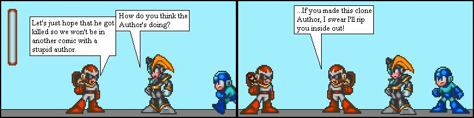
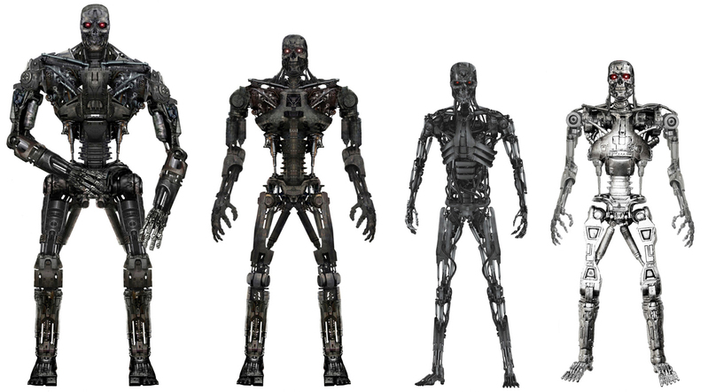

# My Function, My Choice!


## Constructor Functions

### Starring Arnold Schwarzenegger

| Lesson Objectives                        |
| :--------------------------------------- |
| Use constructor functions to create variable objects |
| Explain how `new` relates to constructor functions |
| Describe the need for constructor functions in OOP |
| Explain how `this` is used in constructor functions |
| Explain the difference between the returned values of regular functions and constructor functions |

## Roadmap

1. Gaining Ground on Object Oriented Programming Concepts
2. Arnold's Big New Blockbuster - Going Beyond Object Literals
3. We're Gonna Need an Army - Custom Constructor Function
4. Arnold the Machine - Practice
5. That's a Wrap! - Outro

## Gaining Ground on OOP Concepts



### Intro to Prototypal Inheritance

As we already know, as developers we practice OOP techniques to craft ourprograms from models of real-world objects.

Virtually all OOP languages use what's known as a class-based approach where new objects are created from classes that are used to construct new objects.

JavaScript is the only OOP language in wide use that uses a prototype-based style of OOP where new objects are based upon the prototype of other objects, not a class (...until ES6 is everywhere).

We call this prototypal inheritance - we'll come to fully understand this term later in the course. For now, we'll focus on a key aspect: creating custom constructor functions that give us the ability to create a template for countless similar, yet variable objects.

**When do you think you'd need multiple versions of an object?**

## Arnold's Big New Blockbuster


### Going Beyond Object Literals

Spry ol' Arnold Schwarzenegger is spending his entire fortune on creating one final, ultimate action movie that pulls together all of his hits of the past.

``` javascript
var arnold = {
  name:  "Arnold",
  health:     10000,
  oneLiners:  [
               "You should not drink and bake.",
               "Stick around!",
               "You're luggage.",
               "What killed de dinosaurs? DE ICE AGE!",
               "Hasta la vista... baby."
              ]
}
```

> What do we call this syntax (hint: how did we create the object)?

Arnold has been training for his big shoot as he expects this will be the greatest film ever.

> How would we add a __key__ of `puny` with a __value__ of `false`?

**Let's add a method to `arnold` called `machete`.** It should:

- Take one argument called `enemy`
- Remove `100` from the `enemy.health` property
- Log out the second string in the `oneLiners` array
- `return` the enemy's scream, if the enemy's health is 0 or less.

Arnold is so pumped about his new blackhole of an investment, he's going way beyond your everyday machete:

``` javascript
arnold.shotgun = function(enemy1, enemy2, enemy3) {
  enemy1.health -= 100;
  enemy2.health -= 100;
  enemy3.health -= 100;

  console.log(arnold.oneLiners[4]);

  if (enemy1.health < 0) return enemy1.scream;
  if (enemy2.health < 0) return enemy2.scream;
  if (enemy3.health < 0) return enemy3.scream;
}
```

But this method takes three whole enemies - that's going to be a lot of time

and money if we do casting calls for each enemy. Sure, we may use an object

constructor for the main villain:

``` javascript
var headVillain = new Object();

headVillain.name = "Thulsa Doom";

headVillain.actor = "James Earl Jones";

headVillain.scream = "HISSSSSSSS!";

headVillain.health = 5000;
```

### Pause for Clarity

Before we can truly understand what's happening with JS constructor functions, there are a couple key terms that we should cover.

#### The `constructor` Property

As we know, javascript comes with a ton of built in methods. Today, we're going to look at the `constructor` method.

In chrome, I'd like everyone type `arnold.constructor` in the console.

**What did you get?**

What this is telling us, is that using object literal notation to create new objects is just a shortcut for calling:

``` javascript
var arnold = new Object();

```

So `arnold` was actually created by the `Object` constructor function! We simply added properties within it, much like adding the `puny` attribute or the `machete` method.

#### The `new` Operator

According to MDN:

> "The new operator creates an instance of a user-defined object type or of one of the built-in object types that has a constructor function."

***uhh... whut?***

For now, simply understand that using the `new` operator before a constructor function is passing in a `{}` to bind to the variable aspects of the function. Or, simpler yet, it's creating a new object out of the function. If this is still confusing, don't worry, we'll be revisiting this throughout the lesson.

### Back to Our Regularly Scheduled Programming...

But Arnold's budget simply cannot accomodate taking this long to find actors.

And we already know that object literal notation doesn't go too much faster...

> Help create a `predator` object.

We need to hire extras as henchmen and a lot of them. There must be a faster way to access a ton of similar, but slightly variable talent!

## We're Gonna Need an Army


### Introducing Custom Constructor Functions

Let's look at a `henchman` object written in object literal notation.

``` javascript
var henchman = {
  health: 20,
  puny: true,
  scream: "AHHH!!",
  alarm: function() {
    alert("Intruder!!");
  }
}
```

And as we've said it's pretty tiring (& expensive!!!) to make all the henchmen in this fashion; let's make a constructor function instead!

Instead of opening up an object, and assigning it to an object literal, we'll be creating them with a function.

``` javascript
var Henchman = function() {
	this.health = 20;
	this.puny = true;
	this.alarm = function() {
		alert("Intruder!");
	}
}
```

> Don't forget to capitalize your constructor functions!

#### Then `this` Thing Happened...

`this` is a simple, yet frustratingly difficult keyword to fully grok. We'll be taking it in bite sizes throughout WDI.

In the case of the `Henchman` constructor function, `this` refers to the object that is being created by the `new` operator. Therefore, you're placing the same values directly on the new variable by simply calling:

`var bennet = new Henchman();`

Howevever, `this` is much more powerful than it seems. Since we're assigning properties to an object as it's being created, we have full control over the range of values assigned to each __instance__ (the created object) of the constructor function.

``` javascript
var Henchman = function(puny, scream, health) {
  this.puny = puny;
  this.scream = scream;
  this.health = health;
  this.alarm = function(enemy) {
    alert("Intruder! It's " + enemy.name + "!");
  }
  this.shoot = function(enemy) {
    enemy.health -= 100;
    if (enemy.health <= 0) return enemy.oneLiners[0];
  }
}
```

When we create a new object using this constructor function, we assign the values to the properties of the object as it's being created.

Let's create a new henchman:

``` javascript
var annoyingKindergartener = new Henchman(true, "It's a tumor!!", 25);
```

Now, when we type: `annoyingKindergartener.scream;` we get `"It's a tumor!"`.

> Let's build a couple more henchmen.

What we've done is create a variable constructor to build henchmen with the same key names but different values.

__What are some other properties we could add to our henchman constructor function?__

#### Arnold, the Fear of Any Henchman - Referencing Other Objects

Let's add to our constructor functions to see how we can reference other objects in creating our new objects.

As any seasoned henchman will tell you, Arnold is fear incarnate. So much so, that the average henchman will assign the concept of fear to Arnold in their mind.

``` javascript
var Henchman = function(puny, scream, health, fear) {
  this.puny = puny;
  this.scream = scream;
  this.health = health;
  this.fear = fear;
  this.alarm = function(enemy) {
    alert("Intruder! It's " + enemy.name + "!");
  }
  this.shoot = function(enemy) {
    enemy.health -= 100;
    if (enemy.health <= 0) return enemy.oneLiners[0];
  }
}

// Create new instance of henchman
var sully = new Henchman(true, "Gyahahahhhhh", 65, arnold);
```

Now, if we were to type `sully.fear;` into our chrome console, we'd see that we get an object back, referencing our `arnold` object.

> What if I wanted to reference their boss, the `headVillain`?

#### Intro to the Prototype Object

Assigning functions within a constructor function is actually bad form. While there is only a single copy of the constructor function in memory, each object being created takes up a little more memory. If each of these objects have copies of a bunch of functions, it could add up.

By moving our object's methods to the _prototype_ of the constructor, there will be only one copy of those functions, instead of one for each of the objects created with the henchman constructor function! Additionally, methods added to the prototype will be available to objects created with the constructor function before the method was instantiated!

Putting functions on the __prototype__ of a constructor function instead of on each object is best practice and it'll be what you see much more often in the field.

As an example:

``` javascript
var Henchman = function(puny, scream, health, fear) {
  this.fear = fear;
  this.health = health;
  this.puny = puny;
  this.scream = scream;
}

Henchman.prototype.shoot = function(enemy) {
	enemy.health -= 100;
   if (enemy.health <= 0) return enemy.oneLiners[0];
}

Henchman.prototype.alarm = function(enemy) {
    alert("Intruder! It's " + enemy.name + "!");
}

var dynamo = new Henchman(true, "LAAAAAAH!", 200, arnold);
```

And we can call methods in the __exact same way__ as our previous constructor function.

`dyanmo.alarm(arnold);`

## Arnold the Machine



### Practice

__Now it's your turn to create a constructor function with custom methods!__

*Please practice by completing one or both of the following*:

1. Arnold needs a bunch of heroes for his new flick. Although he'll be doing pretty much everything, it's always nice to have a bud.
  - Create a Hero constructor function from scratch with different abilities (look at the `arnold` object for guideance). Make heroes like Sylvester Stallone, Jan Michael Vincent and Jean-Claude van Damm from the same constructor function!


2. Turns out Arnold spent about half his money making a factory that produces terminators that look and act just like him. Maybe a waste, but we'll see if it pays dividends in the box office:
  - Create your own `terminator` constructor function and make the Arnold object into a variable constructor function. Make sure he has all the awesome properties we know and expect from Arnold.

## That's a Wrap!

Inheritance is one of the most important aspects of programming. You can now create templates for the repeated objects in your programs!

Let's take a moment to review what we've learned:

1. Explain the `new` operator and the `constructor` property
2. How is `this` used in constructor functions?
3. Why are constructor functions so essential in OOP?

#### References

[MDN Working with Objects](https://developer.mozilla.org/en-US/docs/Web/JavaScript/Guide/Working_with_Objects)

[Beautiful Response on the Value of Prototypal Inheritance](http://stackoverflow.com/questions/2800964/benefits-of-prototypal-inheritance-over-classical)

[Wikipedia - Object Oriented Programming](http://en.wikipedia.org/wiki/Object-oriented_programming)
